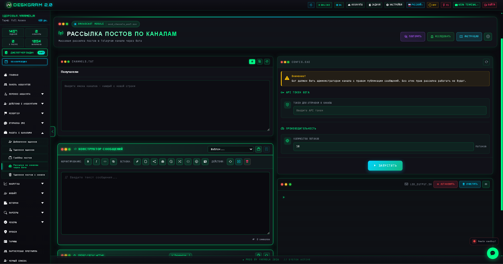
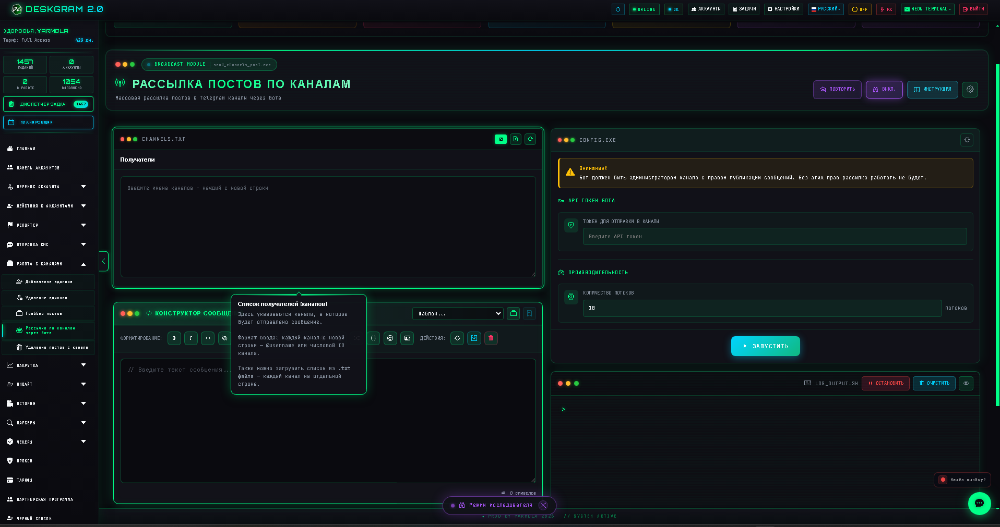
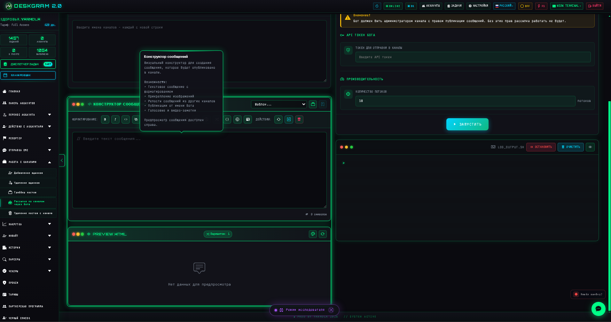
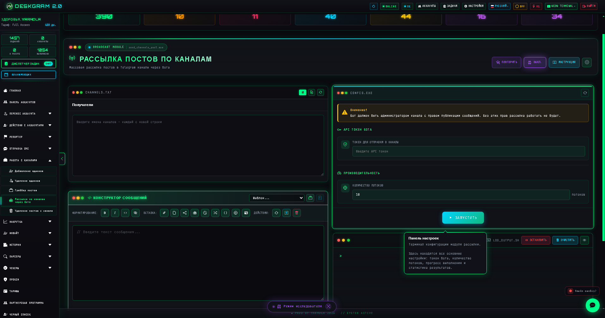

# Рассылка постов по каналам через Deskgram 2

Рассылка постов по каналам в Deskgram 2 помогает пакетно публиковать готовые сообщения в Telegram-каналы через бота. Этот сценарий полезен, когда нужно не вручную раскладывать контент по десяткам площадок, а централизованно управлять списком каналов, сообщением, токеном бота и скоростью публикации.

[Главный хаб Deskgram 2](https://github.com/Deskgram-2/deskgram-2-telegram-automation) · [Сайт](https://deskgram2.com/) · [Telegram-бот](https://t.me/DG2welcomebot) · [Web preview](https://deskgram2.com/web-preview?path=%2Fapp-demo%2F&lang=ru)
## Интерактивный Web Preview

Попробовать модуль в браузере: [Открыть веб-превью](https://deskgram2.com/web-preview?path=%2Fapp-demo%2Ffunctions%2Fsend_channels_post&lang=ru)

## Скриншоты

## Кратко о модуле

| Параметр | Что внутри |
|---|---|
| Основная задача | Массовая публикация постов в Telegram-каналы через бота |
| Важные блоки | Список каналов, конструктор сообщения, токен бота, потоки, лог публикаций |
| Полезен для | Контентных сеток, мультиканальной дистрибуции, централизованного постинга |
| Связанные модули | Создание ботов, создание каналов, диспетчер задач, настройки |

## Что умеет модуль

- работать по списку Telegram-каналов;
- публиковать одно сообщение сразу в серию площадок;
- использовать токен Telegram-бота и контролировать права публикации;
- управлять количеством потоков и темпом отправки;
- показывать прогресс, успешные отправки и ошибки в логах.

## Быстрый старт

1. Подготовьте список каналов, куда должен отправляться пост.
2. Соберите сообщение в конструкторе.
3. Укажите API-токен бота.
4. Настройте количество потоков и рабочий темп.
5. Запустите задачу и отслеживайте результат по логам.

## С чем особенно хорошо работает этот сценарий

- [Создание Telegram-ботов](https://github.com/Deskgram-2/telegram-bot-creator-deskgram), если под канал-постинг вы сначала поднимаете рабочую бот-инфраструктуру;
- [Создание каналов и групп](https://github.com/Deskgram-2/telegram-channel-creator-deskgram), если каналы создаются и наполняются в рамках одной цепочки;
- [Настройки](https://github.com/Deskgram-2/telegram-automation-settings-deskgram), если нужно заранее выровнять общие параметры системы;
- [Диспетчер задач](https://github.com/Deskgram-2/telegram-task-manager-deskgram), если публикации нужно контролировать вместе с остальными сценариями.

## Как устроен сценарий

### База каналов

В модуле задается список каналов-получателей. Это позволяет заранее собрать рабочую матрицу площадок и не переключаться между ними вручную.

### Конструктор публикации

Сообщение собирается один раз в визуальном конструкторе. За счет этого удобнее держать единый формат публикации и не переписывать контент для каждого канала отдельно.

### Управление темпом

Параметры потоков и логика запуска помогают держать баланс между скоростью и стабильностью публикации, особенно если сеть каналов уже широкая.

## Когда особенно полезен

- когда одна публикация должна выйти сразу в серию Telegram-каналов;
- когда контент публикуется по расписанию или пакетами;
- когда важно централизованно управлять ботом и списком площадок;
- когда ручной постинг начинает тормозить рост сети каналов.

## Почему это удобнее ручной раскладки постов

| Ручной подход | Рассылка постов по каналам в Deskgram 2 |
|---|---|
| Нужно отдельно заходить в каждый канал | Один сценарий работает по списку каналов |
| Сложно держать единый формат постов | Контент собирается централизованно |
| Легко терять темп и последовательность | Потоки и запуск контролируются из одного места |
| Почти нет нормальной операционной картины | Есть лог, прогресс и статистика |

## Сценарии применения

### Сценарий 1. Контентная сетка из нескольких каналов

Если одна и та же публикация должна выходить сразу в несколько каналов, модуль снимает ручную раскладку и собирает все в один поток. Это особенно удобно для продуктовых, новостных и промо-сеток.

### Сценарий 2. Публикация после инфраструктурной подготовки

Когда у вас уже есть бот, каналы и базовая среда, этот модуль становится логичным execution-слоем. В такой схеме он часто идет после [создания ботов](https://github.com/Deskgram-2/telegram-bot-creator-deskgram) и [создания каналов и групп](https://github.com/Deskgram-2/telegram-channel-creator-deskgram).

### Сценарий 3. Контент как часть общей воронки

Иногда канал-постинг нужен не сам по себе, а как центр связки: сначала публикуется контент, потом под него запускаются комментарии, сбор аудитории или stories-слой. В этом случае репозиторий хорошо работает как хаб для дальнейших execution-модулей.

## Что выбрать: публикацию по каналам или сторис

| Если задача такая | Лучше использовать |
|---|---|
| Нужно раскладывать один пост по сети каналов | [Рассылка постов по каналам](https://github.com/Deskgram-2/telegram-channel-posting-deskgram) |
| Нужен более визуальный и stories-ориентированный охват | [Отметки в сторис](https://github.com/Deskgram-2/telegram-story-mentions-deskgram) |
| Нужен и контентный, и social-слой | Канал-постинг + stories как два отдельных сценария |
| Нужна подготовка площадок до публикации | Сначала [создание каналов и групп](https://github.com/Deskgram-2/telegram-channel-creator-deskgram), потом канал-постинг |

## Что выбрать: канал-постинг или создание каналов

| Если задача такая | Лучше использовать |
|---|---|
| Нужно уже публиковать контент по существующей сетке каналов | [Рассылка постов по каналам](https://github.com/Deskgram-2/telegram-channel-posting-deskgram) |
| Нужно сначала развернуть сами площадки | [Создание каналов и групп](https://github.com/Deskgram-2/telegram-channel-creator-deskgram) |
| Нужен путь `создать -> наполнить -> масштабировать` | Сначала создание каналов, затем канал-постинг |
| Нужна только контентная дистрибуция без разворачивания новых площадок | Канал-постинг |

## Смежные репозитории

- [Главный хаб Deskgram 2](https://github.com/Deskgram-2/deskgram-2-telegram-automation)
- [Создание Telegram-ботов](https://github.com/Deskgram-2/telegram-bot-creator-deskgram)
- [Создание каналов и групп](https://github.com/Deskgram-2/telegram-channel-creator-deskgram)
- [Настройки](https://github.com/Deskgram-2/telegram-automation-settings-deskgram)
- [Диспетчер задач](https://github.com/Deskgram-2/telegram-task-manager-deskgram)

## FAQ

### Это модуль именно для бота, а не для обычных аккаунтов?

Да. Базовый сценарий строится вокруг Telegram-бота, который должен иметь права на публикацию в целевых каналах.

### Тут можно централизованно публиковать одну и ту же заготовку?

Да. В этом и основная практическая ценность модуля: собрать сообщение один раз и разложить его по сетке каналов.

## FAQ для рабочих сценариев

### Когда модуль лучше использовать как самостоятельный контентный слой?

Когда площадки уже созданы, бот-инфраструктура готова, а главная задача — централизованно разложить контент по сети каналов без ручного обхода каждой площадки.

### Когда публикацию по каналам логичнее сочетать со stories?

Когда вам нужен не один тип дистрибуции, а сразу несколько касаний: основной контент уходит в каналы, а дополнительный social-охват и визуальный слой поддерживаются через stories.

### Что чаще всего ограничивает эффективность такого сценария?

Обычно это не сам модуль, а качество канальной сетки, готовность бота, структура контента и то, встроен ли постинг в более широкую контентную воронку, а не используется ли изолированно.

